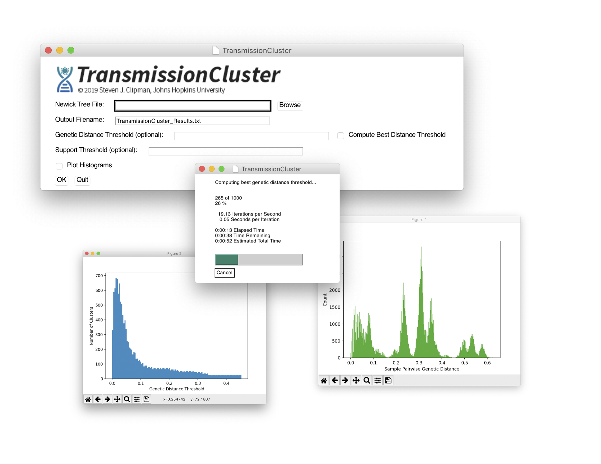

## v1.0
  TransmissionCluster is a GUI Python program that computes the optimal genetic distance threshold and identifies clusters in a phylogenetic tree.

  Given a Newick (.nwk) formatted tree, an optional genetic distance threshold *d* and optional support threshold *s*, TransmissionCluster finds the minimum number of clusters of samples in the tree such that:

  1. The maximum pairwise distance between samples in the cluster is at most *d*.\*
  2. Samples cannot be connected by branches with support less than or equal to *s*.
  3. The samples in the cluster must define a clade in the tree.

  >\*TransmissionCluster can compute the distance threshold that maximizes the number of non-singleton clusters over all biologically meaningful thresholds from 0 to *d* in steps of 0.0001 (i.e., 0, 0.001, 0.002, ..., *d*). The upper limit *d* is determined by plotting a histogram of sample pairwise distances and selecting the maximum distance that represents the tail end of the distribution of *within* subtype distances (versus *between* subtype pairwise distances) as this represents the upper limit of a epidemiologically meaningful threshold.

## Installation & Usage

  **For MacOS Users:**
  - An executable file with all dependencies bundled can be found in `/dist`.
  - Right-click and select 'Open' to run.
  - If the executable does not behave as expected follow general installation below.

  **General Installation and Execution:**
  1. Clone or download this repository.
  2. Ensure that Python3 and all dependencies are installed (see below).
  3. Run using one of the following terminal commands:
  - `./TransmissionCluster.py`
  - `python3 TransmissionCluster.py`

  **Required Parameters:**
  - A Newick formatted phylogenetic tree (.nwk)
  - Output Filename
    - Note: When using the distance-free method this threshold is used as the upper bound of possible thresholds to compute.

  **Optional Parameters:**
  - Genetic Distance Threshold
    - Specify a threshold or select 'Compute Best Distance Threshold' (when unchecked TransmissionCluster uses the specified threshold)
  - Posterior/Bootstrap Support Threshold
  - Plot Pairwise Distance Histogram

## Screenshots

## Dependencies
  * [Python 3](https://www.python.org/downloads/)
  * [TreeSwift](https://github.com/niemasd/TreeSwift)
    - Install via pip: `pip install treeswift`
  * [PySimpleGUI](https://pypi.org/project/PySimpleGUI/)
    - Install via pip: `pip install pysimplegui`
  * [Matplotlib](https://matplotlib.org/3.1.1/index.html)
    - Install via pip: `pip install matplotlib`

### Acknowledgements
TransmissionCluster utilizes the "Max Clade" algorithm from [TreeCluster](https://github.com/niemasd/TreeCluster).
