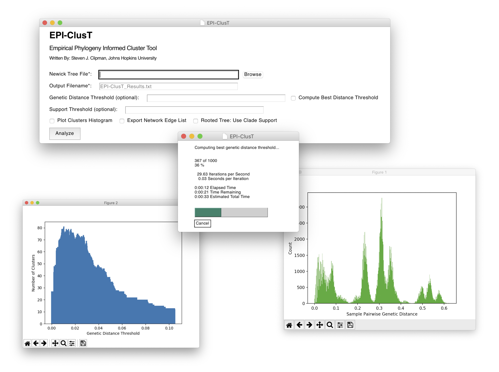

## v1.0
  EPI-ClusT is a GUI Python program that helps researchers compute the optimal genetic distance threshold and identify clusters in a phylogenetic tree.

  Given a Newick `.nwk` formatted tree, an optional genetic distance threshold *d* and optional support threshold *s*, EPI-ClusT finds the minimum number of clusters of samples in the tree such that:

  1. The maximum pairwise distance between samples in the cluster is at most *d*.\*
  2. Samples cannot be connected by branches with support less than or equal to *s*.

  And (optionally) when given a rooted tree:

  3. The samples in the cluster must define a clade in the tree.

  >\*EPI-ClusT can compute the distance threshold that maximizes the number of non-singleton clusters over all meaningful thresholds from 0 to *dMax* in steps of 0.0001 (i.e., 0, 0.001, 0.002, ..., *dMax*). The upper limit *dMax* is specified by the user. EPI-ClusT first plots a histogram of sample pairwise distances and the user is prompted to select *dMax* from the first local minimum i.e. the tail of the first peak (which corresponds to the pairwise distances of the most closely related samples) as this represents the upper limit of an epidemiologically meaningful threshold for clustering.

## Installation & Usage

  **For MacOS Users:**
  - An executable file with all dependencies bundled can be found in `/dist`.
  - Right-click and select 'Open' to run.
  - If the executable does not behave as expected follow general installation below.

  **General Installation and Execution:**
  1. Clone or download this repository.
  2. Ensure that Python3 and all dependencies are installed (see below).
  3. Run using one of the following terminal commands:
  - `./EPI-ClusT.py`
  - `python3 EPI-ClusT.py`

  **Required Parameters:**
  - A Newick formatted phylogenetic tree (.nwk)
  - Output Filename
  - Note: When using the distance-free method *dMax* is required. This threshold is used as the upper bound of possible thresholds to compute.

  **Optional Parameters:**
  - Genetic Distance Threshold
    - Specify a threshold or select 'Compute Best Distance Threshold' (when unchecked EPI-ClusT uses the specified threshold)
  - Posterior/Bootstrap Support Threshold
  - Plot Clusters Histogram (i.e. number of clusters over distance thresholds)
  - Export Network Edge List
  - Rooted Tree: Use Clade Support

## Screenshot

## Dependencies
  * [Python 3](https://www.python.org/downloads/)
  * [TreeSwift](https://github.com/niemasd/TreeSwift)
    - Install via pip: `pip install treeswift`
  * [PySimpleGUI](https://pypi.org/project/PySimpleGUI/)
    - Install via pip: `pip install pysimplegui`
  * [Matplotlib](https://matplotlib.org/3.1.1/index.html)
    - Install via pip: `pip install matplotlib`

## Clustering Algorithm
EPI-ClusT utilizes the "Max Clade" algorithm from [TreeCluster](https://github.com/niemasd/TreeCluster).

## Disclaimer
This software is supplied 'as-is', with no warranty of any kind expressed or implied. The author has made a reasonable effort to avoid errors in design and execution of this software, but will not be liable for its use or misuse. The user is solely responsible for the validity of any results generated. Specifically, the author is not liable for any damage or data loss resulting from the use of this software, even if it is due to negligence on the part of the author of this software.
This software and this document are the responsibility of Steven J. Clipman, PhDc, MSPH. The views expressed herein do not necessarily represent the views of Johns Hopkins University.
